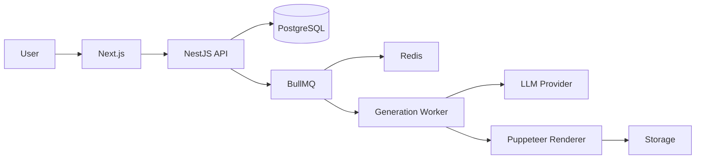

# Slideify

**AI-powered content repurposing micro-SaaS.**

Transform text, articles, or long-form content into structured social-media-ready assets: carousel posts, PDFs, slide images, and publication text.

---

## Status

**Pre-development / Foundation** — The product is in early foundation stages. Core architecture and documentation are being established before MVP implementation.

---

## Proposition de valeur

Les créateurs, consultants, entrepreneurs et marketeurs peuvent rapidement transformer un contenu existant en publications sociales prêtes à l'emploi, sans avoir à recomposer manuellement chaque format. Slideify automatise l'extraction, la structuration et le rendu visuel du contenu.

---

## Problème résolu

- Content repurposing est chronophage et nécessite des compétences en design
- Chaque format (carrousel, PDF, image) demande un outil et un processus différents
- Pas de solution unifiée pour réutiliser du contenu existant

---

## Fonctionnement

1. **Input** : Utilisateur fournit du texte brut ou une URL d'article
2. **Extraction** : Le backend extrait le contenu pertinent
3. **Structure** : Le contenu est structuré en sections/logiques de slides
4. **Rendering** : Puppeteur rend HTML/CSS en images PDF/PNG
5. **Output** : Fichiers prêts à publier sur les réseaux sociaux

---

## Architecture prévue



---

## Stack

- **Frontend**: Next.js, TypeScript, Tailwind CSS
- **Backend**: NestJS, TypeScript
- **Database**: PostgreSQL, Prisma ORM
- **Queue**: BullMQ, Redis
- **Rendering**: Puppeteer, HTML/CSS
- **CI/CD**: GitHub Actions

---

## Structure du repository

```
/
├── apps/
│   ├── web/      # Next.js frontend
│   ├── api/      # NestJS backend
│   └── worker/   # Generation worker
├── packages/
│   ├── shared/   # Shared types/utils
│   ├── config/   # Configuration
│   └── ui/       # UI components
├── docs/
│   ├── PRODUCT.md
│   ├── ARCHITECTURE.md
│   ├── ROADMAP.md
│   ├── DECISIONS.md
│   ├── AGENTS.md
│   └── TASKS.md
├── .env.example
├── .gitignore
├── README.md
└── package.json
```

---

## Installation future

```bash
# Clone
git clone <repo-url>
cd slideify

# Install dependencies
bun install     # ou npm install / pnpm install

# Environment
cp .env.example .env
# Remplir les variables .env

# Database
prisma generate
prisma migrate dev --init

# Redis (local)
redis-server

# Development
bun run dev     # ou npm run dev / pnpm dev

# Worker
bun run worker  # Traitement asynchrone BullMQ
```

---

## Variables d'environnement

Voir `.env.example` pour la liste complète. Toutes les variables sont des placeholders — aucune clé API réelle n'est fournie.

---

## Développement local

- Le projet s'exécute localement sans services cloud payants
- Redis peut être lancé en local (`redis-server`)
- PostgreSQL peut être local via Docker ou directement
- Les providers LLM sontMockés ou abstraits pour le développement
- Les tests utilisent des mocks locaux

---

## Tests

À définir lors de l'implémentation du MVP. Structure prévue :
- Tests unitaires (Jest)
- Tests d'intégration (API endpoints)
- Tests E2E ( flux complet generation )

---

## Git workflow

- Branche principale : `main`
- Développement : `develop`
- Nouvelles fonctionnalités : `feature/<nom>`
- Correctifs : `fix/<nom>`
- Convention de commits : `type: description` (voir CONTRIBUTING.md)

---

## Roadmap

Voir `docs/ROADMAP.md` pour la roadmap détaillée. Grandes phases :
1. Foundation (courant) — Documentation, architecture, scaffolding
2. MVP Core — Génération de base, queue, rendu PDF simple
3. Features Avancées — Carrousels, stockage, auth, payments
4. Production — Monitoring, scaling, custom domains

---

## Contributing

Voir `docs/CONTRIBUTING.md` pour les guidelines de contribution.

---

## License

Voir `DECISIONS.md` concernant la décision de licence. Aucune licence définitive n'a été choisie pour l'instant.