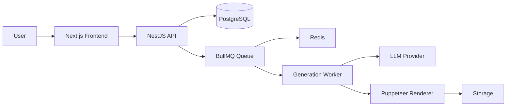

# ARCHITECTURE.md

## Architecture logique

## Responsabilités par couche

### Frontend (Next.js)
- Interface utilisateur : upload, preview, sélection de template
- Appels API vers le backend NestJS
- Gestion de l'état local et des formulaires
- Affiche les résultats (preview des générations)

### Backend API (NestJS)
- Routes d'authentification et d'upload
- Validation et transformation des données
- Envoi de tâches dans la queue BullMQ
- Gestion des réponses LLM (via interface abstraite)
- Endpoints de statut de génération

### Worker (BullMQ + Redis)
- Consommation des tâches de génération
- Appel du service LLM (ou mock)
- Rendu HTML/CSS via Puppeteer
- Génération PDF ou PNG
- Stockage des résultats en base

### Database (PostgreSQL + Prisma)
- Modèles : User, Generation, Template, Output
- Historique des générations
- Préférences utilisateur
- Métadonnées des sorties (URL, taille, format)

### AI Layer
- Interface abstraite LLMProvider
- MockProvider pour le développement
- Implémentation réelle (OpenRouter) en production

### Rendering Layer
- Templates HTML/CSS (EJS / handlebars)
- Puppeteer page rendering
- Conversion PDF/PNG
- Optimisation des fichiers

## Couches non encore implémentées
- Payment layer (à ajouter plus tard)
- Storage layer cloud (AWS S3 / similar)
- Auth complet (à définir)